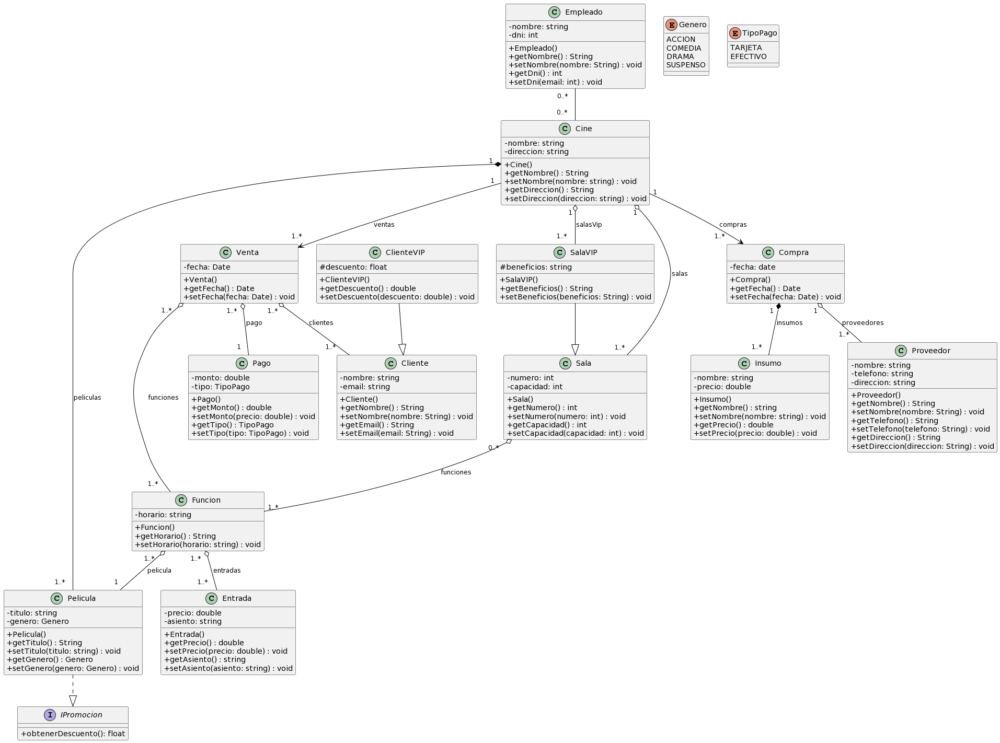

# 🎬 Cine Mendoza — Sistema de Gestión

Sistema de gestión interna para un cine, desarrollado como proyecto integrador de la materia **Programación Orientada a Objetos** en el **Instituto Tecnológico Universitario (ITU) — UNCuyo**.

---

## 📋 Diagrama de Clases UML



---

## 🧱 Descripción del Proyecto

**Cine Mendoza** es una aplicación web que permite administrar todas las operaciones internas de un cine: películas en cartelera, funciones, venta de entradas, clientes, empleados, compras de insumos y proveedores.

El sistema implementa los conceptos de **herencia**, **polimorfismo** e **interfaces** vistos en clase, llevados a una aplicación real con base de datos relacional y autenticación de usuarios.

---

## 🗂️ Modelo de Dominio

El sistema está compuesto por las siguientes entidades, respetando el diagrama UML entregado:

| Clase | Descripción |
|---|---|
| `Cine` | Entidad raíz. Contiene empleados, salas, ventas y compras |
| `Empleado` | Personal del cine con nombre y DNI |
| `Sala` | Sala de proyección con número y capacidad |
| `SalaVIP` | Extiende `Sala` — agrega beneficios especiales |
| `Pelicula` | Implementa `IPromocion` — título, género y sinopsis |
| `IPromocion` | Interfaz con el método `obtenerDescuento()` |
| `Funcion` | Une una `Pelicula` con una `Sala` en un horario |
| `Entrada` | Precio y asiento para una `Funcion` |
| `Cliente` | Cliente con nombre y email |
| `ClienteVIP` | Extiende `Cliente` — agrega descuento |
| `Pago` | Monto y tipo de pago (EFECTIVO / TARJETA) |
| `Venta` | Agrupa `Pago`, `Cliente`s y `Funcion`es |
| `Compra` | Agrupa `Insumo`s y `Proveedor`es |
| `Insumo` | Producto con nombre y precio |
| `Proveedor` | Proveedor con nombre, teléfono y dirección |

**Enums:**
- `Genero`: ACCION, COMEDIA, DRAMA, SUSPENSO
- `TipoPago`: EFECTIVO, TARJETA

---

## 🛠️ Tecnologías Utilizadas

| Tecnología | Versión | Uso |
|---|---|---|
| Java | 21 (LTS) | Lenguaje principal |
| Spring Boot | 3.3.4 | Framework web |
| Spring Security | 6.x | Autenticación y autorización |
| Spring Data JPA | 3.3.x | Persistencia con Hibernate |
| MySQL | 8.x | Base de datos relacional |
| Thymeleaf | 3.x | Motor de plantillas HTML |
| Bootstrap | 5.3.3 | Estilos y diseño responsive |
| Lombok | 1.18.x | Reducción de código repetitivo |
| Maven | 3.x | Gestión de dependencias |

---

## 📁 Estructura del Proyecto

```
cine-mendoza/
├── pom.xml
└── src/
    └── main/
        ├── java/com/cine/
        │   ├── CineMendozaApplication.java
        │   ├── config/
        │   │   ├── SecurityConfig.java
        │   │   ├── WebConfig.java
        │   │   └── DataInitializer.java
        │   ├── controller/
        │   │   └── (13 controllers)
        │   ├── entity/
        │   │   └── (16 entidades + 1 interfaz)
        │   ├── enums/
        │   │   └── Genero.java / TipoPago.java / Rol.java
        │   ├── repository/
        │   │   └── (15 repositories)
        │   └── service/
        │       └── (12 services)
        └── resources/
            ├── application.properties
            ├── messages.properties
            ├── static/
            │   ├── css/style.css
            │   └── js/validaciones.js
            └── templates/
                ├── fragments/
                └── (12 módulos × 2 vistas)
```

---

## ⚙️ Configuración y Ejecución

### Pre-requisitos

- Java 21 instalado
- MySQL 8.x corriendo en `localhost:3306`
- IntelliJ IDEA (Community o Ultimate)

### Pasos para ejecutar

**1.** Clonar el repositorio:
```bash
git clone https://github.com/LucianoMalancaTorrez/VentaCine.git
cd cine-mendoza
```

**2.** Editar la contraseña de MySQL en `src/main/resources/application.properties`:
```properties
spring.datasource.password=tu_password_aqui
```

**3.** Ejecutar el proyecto desde IntelliJ:
- Abrir la carpeta como proyecto Maven
- Ejecutar `CineMendozaApplication.java`

> ✅ La base de datos `cine_mendoza` y todas las tablas se crean automáticamente al iniciar.

---

## 👤 Usuarios por Defecto

Al iniciar la aplicación por primera vez se crean automáticamente:

| Usuario | Contraseña | Rol | Acceso |
|---|---|---|---|
| `admin` | `admin123` | ADMIN | Acceso total |
| `operador` | `operador123` | OPERADOR | Cartelera, clientes y ventas |

Ingresar en: `http://localhost:8080/login`

---

## 🔐 Roles y Permisos

| Módulo | ADMIN | OPERADOR |
|---|---|---|
| Dashboard | ✅ | ✅ |
| Películas | ✅ | ✅ |
| Funciones | ✅ | ✅ |
| Entradas | ✅ | ✅ |
| Salas | ✅ | ✅ |
| Clientes | ✅ | ✅ |
| Ventas | ✅ | ✅ |
| Empleados | ✅ | ❌ |
| Compras | ✅ | ❌ |
| Insumos | ✅ | ❌ |
| Proveedores | ✅ | ❌ |
| Usuarios | ✅ | ❌ |

---

## ✅ Validaciones Implementadas

- **Campos numéricos:** no aceptan letras (DNI, capacidad, precio, monto)
- **Email:** formato válido obligatorio
- **Teléfono:** solo números, +, - y espacios
- **Contraseña:** mínimo 6 caracteres, confirmación obligatoria
- **DNI:** único por empleado — validado en backend y frontend
- **Email de cliente:** único — validado en backend
- **Número de sala:** único por cine
- **Asiento:** único por función
- **Horario:** sin choques en la misma sala
- **Mensajes de error:** en español, debajo de cada campo

---

## 👨‍💻 Autor

| Campo | Dato |
|---|---|
| Nombre | Luciano Malanca Torrez |
| Materia | Programación Orientada a Objetos |
| Institución | ITU — UNCuyo |
| Año | 2025 |
